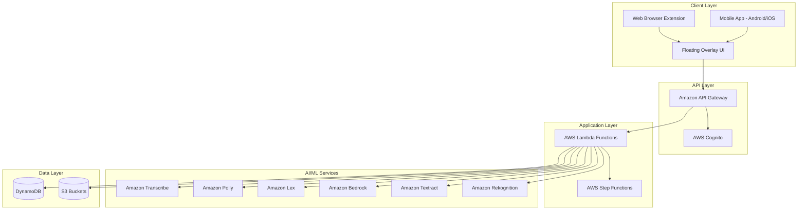

# Design Document: NS AI - Bharat Inclusive Floating AI Assistant

## Overview

NS AI is a voice-first, floating AI assistant designed to democratize access to digital government services for Tier-2 and Tier-3 Indian citizens. The system combines conversational AI, visual guidance, and multi-language support to help users navigate complex government service applications.

The architecture leverages AWS serverless services to provide a scalable, cost-effective solution that works across mobile devices and web browsers. The floating overlay design ensures the assistant remains accessible regardless of which application or website the user is interacting with.

### Key Design Principles

1. **Voice-First**: Speech is the primary interaction mode, with text as a fallback
2. **Visual Simplicity**: Emoji-based navigation and minimal text for low-literacy users
3. **Context Preservation**: All progress is saved automatically to enable resumption
4. **Offline Resilience**: Core functionality degrades gracefully without connectivity
5. **Privacy by Design**: All personal data is encrypted and user-controlled

## Architecture

### High-Level Architecture



### Component Architecture

The system follows a microservices architecture with the following key components:

1. **Frontend Layer**: Native mobile app (React Native) and browser extension (JavaScript)
2. **API Gateway**: RESTful and WebSocket APIs for real-time communication
3. **Authentication Service**: Cognito-based phone authentication with OTP
4. **Voice Processing Service**: Transcribe for STT, Polly for TTS
5. **Conversation Service**: Lex for intent recognition, Bedrock for response generation
6. **Workflow Orchestration Service**: Step Functions managing multi-step government service flows
7. **Document Processing Service**: S3 storage, Textract extraction, Rekognition validation
8. **Session Management Service**: DynamoDB for state persistence
9. **Guidance Rendering Service**: Generates visual overlay instructions

## Components and Interfaces

### 1. Floating Overlay Component

**Responsibility**: Provides the persistent UI that floats over other applications

**Interface**:
```typescript
interface FloatingOverlay {
  // State management
  initialize(): Promise<void>
  show(): void
  hide(): void
  minimize(): void
  expand(): void
  setPosition(x: number, y: number): void
  
  // Event handlers
  onDrag(callback: (x: number, y: number) => void): void
  onTap(callback: () => void): void
  onMinimize(callback: () => void): void
}
```

**Implementation Notes**:
- Android: Uses `WindowManager` with `TYPE_APPLICATION_OVERLAY` permission
- iOS: Uses `UIWindow` with elevated window level
- Web: Uses fixed-position div with maximum z-index
- Position persistence stored in local storage

### 2. Voice Interface Component

**Responsibility**: Handles speech-to-text and text-to-speech operations

**Interface**:
```typescript
interface VoiceInterface {
  // Speech-to-text
  startListening(language: LanguageCode): Promise<void>
  stopListening(): Promise<string>
  onTranscriptionUpdate(callback: (partial: string) => void): void
  
  // Text-to-speech
  speak(text: string, language: LanguageCode): Promise<void>
  stopSpeaking(): void
  setSpeechRate(rate: number): void
  
  // Status
  isListening(): boolean
  isSpeaking(): boolean
}

type LanguageCode = 'ta-IN' | 'hi-IN' | 'te-IN' | 'kn-IN' | 'ml-IN' | 
                    'bn-IN' | 'mr-IN' | 'gu-IN' | 'pa-IN' | 'en-IN'
```

**AWS Integration**:
- Transcribe: Streaming API for real-time transcription
- Polly: Neural voices for natural-sounding speech
- Audio streaming via WebSocket for low latency

### 3. Conversation Manager

**Responsibility**: Orchestrates intent recognition and response generation

**Interface**:
```typescript
interface ConversationManager {
  // Session management
  startSession(userId: string, language: LanguageCode): Promise<SessionId>
  endSession(sessionId: SessionId): Promise<void>
  
  // Message handling
  processMessage(sessionId: SessionId, message: string): Promise<Response>
  getConversationHistory(sessionId: SessionId): Promise<Message[]>
  
  // Context management
  setContext(sessionId: SessionId, context: Context): Promise<void>
  getContext(sessionId: SessionId): Promise<Context>
}

interface Response {
  text: string
  intent: Intent
  entities: Entity[]
  nextAction?: Action
  requiresInput: boolean
}

interface Intent {
  name: string
  confidence: number
  slots: Record<string, any>
}
```

**AWS Integration**:
- Lex: Intent recognition with custom slots for government services
- Bedrock: Claude model for contextual response generation
- DynamoDB: Session state and conversation history storage

### 4. Workflow Engine

**Responsibility**: Manages multi-step government service application flows

**Interface**:
```typescript
interface WorkflowEngine {
  // Workflow management
  startWorkflow(type: ServiceType, userId: string): Promise<WorkflowId>
  getWorkflowState(workflowId: WorkflowId): Promise<WorkflowState>
  resumeWorkflow(workflowId: WorkflowId): Promise<WorkflowState>
  completeStep(workflowId: WorkflowId, stepId: string, data: any): Promise<void>
  
  // Progress tracking
  getProgress(workflowId: WorkflowId): Promise<Progress>
  canResume(workflowId: WorkflowId): Promise<boolean>
}

type ServiceType = 'DRIVING_LICENCE' | 'PAN_CARD' | 'VOTER_ID' | 'AADHAAR'

interface WorkflowState {
  workflowId: WorkflowId
  currentStep: Step
  completedSteps: string[]
  pendingSteps: string[]
  data: Record<string, any>
}

interface Step {
  id: string
  type: 'INPUT' | 'DOCUMENT' | 'VALIDATION' | 'SUBMISSION'
  instruction: string
  required: boolean
  validation?: ValidationRule
}
```

**AWS Integration**:
- Step Functions: State machine for each service type
- Lambda: Step execution handlers
- DynamoDB: Workflow state persistence

### 5. Document Handler

**Responsibility**: Manages document upload, validation, and storage

**Interface**:
```typescript
interface DocumentHandler {
  // Upload operations
  uploadDocument(
    workflowId: WorkflowId,
    documentType: DocumentType,
    file: File
  ): Promise<DocumentId>
  
  // Validation
  validateDocument(documentId: DocumentId): Promise<ValidationResult>
  
  // Retrieval
  getDocument(documentId: DocumentId): Promise<Document>
  listDocuments(workflowId: WorkflowId): Promise<Document[]>
  
  // Deletion
  deleteDocument(documentId: DocumentId): Promise<void>
}

type DocumentType = 'PHOTO' | 'ID_PROOF' | 'ADDRESS_PROOF' | 
                    'AGE_PROOF' | 'SIGNATURE'

interface ValidationResult {
  isValid: boolean
  confidence: number
  issues: ValidationIssue[]
  extractedData?: Record<string, any>
}

interface ValidationIssue {
  field: string
  severity: 'ERROR' | 'WARNING'
  message: string
}
```

**AWS Integration**:
- S3: Encrypted document storage with lifecycle policies
- Textract: Text and data extraction from documents
- Rekognition: Face detection, image quality assessment
- Lambda: Validation orchestration

### 6. Guidance Layer

**Responsibility**: Generates and displays visual overlays for user guidance

**Interface**:
```typescript
interface GuidanceLayer {
  // Overlay management
  showGuidance(instruction: GuidanceInstruction): Promise<void>
  hideGuidance(): void
  updateGuidance(instruction: GuidanceInstruction): Promise<void>
  
  // Progress indication
  showProgress(current: number, total: number): void
  hideProgress(): void
}

interface GuidanceInstruction {
  type: 'HIGHLIGHT' | 'ARROW' | 'TOOLTIP' | 'PULSE'
  target: ElementSelector
  message: string
  emoji?: string
  position: 'TOP' | 'BOTTOM' | 'LEFT' | 'RIGHT'
}

interface ElementSelector {
  selector?: string  // CSS selector for web
  coordinates?: { x: number, y: number }  // Absolute position
  bounds?: { x: number, y: number, width: number, height: number }
}
```

**Implementation Notes**:
- Web: DOM manipulation with CSS overlays
- Mobile: Native overlay views with gesture detection
- Synchronization with voice instructions via event bus

### 7. Session Manager

**Responsibility**: Persists and retrieves user session state

**Interface**:
```typescript
interface SessionManager {
  // Session lifecycle
  createSession(userId: string, metadata: SessionMetadata): Promise<SessionId>
  getSession(sessionId: SessionId): Promise<Session>
  updateSession(sessionId: SessionId, updates: Partial<Session>): Promise<void>
  deleteSession(sessionId: SessionId): Promise<void>
  
  // Query operations
  getActiveSessions(userId: string): Promise<Session[]>
  getSessionHistory(userId: string, limit: number): Promise<Session[]>
}

interface Session {
  sessionId: SessionId
  userId: string
  language: LanguageCode
  startTime: Date
  lastActivity: Date
  conversationHistory: Message[]
  workflowId?: WorkflowId
  context: Context
  metadata: SessionMetadata
}

interface SessionMetadata {
  deviceType: 'MOBILE' | 'WEB'
  platform: string
  appVersion: string
}
```

**AWS Integration**:
- DynamoDB: Session table with TTL for automatic cleanup
- GSI on userId for efficient user queries
- Point-in-time recovery enabled

## Data Models

### User Profile

```typescript
interface UserProfile {
  userId: string  // Cognito user ID
  phoneNumber: string
  preferredLanguage: LanguageCode
  createdAt: Date
  lastLogin: Date
  settings: UserSettings
}

interface UserSettings {
  fontSize: 'NORMAL' | 'LARGE'
  speechRate: number  // 0.5 to 2.0
  accessibilityMode: boolean
  notificationsEnabled: boolean
}
```

**Storage**: DynamoDB table `UserProfiles`

### Workflow Instance

```typescript
interface WorkflowInstance {
  workflowId: string
  userId: string
  serviceType: ServiceType
  status: 'IN_PROGRESS' | 'COMPLETED' | 'FAILED' | 'ABANDONED'
  currentStepId: string
  stepData: Record<string, StepData>
  documents: DocumentReference[]
  createdAt: Date
  updatedAt: Date
  completedAt?: Date
}

interface StepData {
  stepId: string
  status: 'PENDING' | 'IN_PROGRESS' | 'COMPLETED' | 'SKIPPED'
  data: any
  completedAt?: Date
}

interface DocumentReference {
  documentId: string
  documentType: DocumentType
  s3Key: string
  uploadedAt: Date
  validationStatus: 'PENDING' | 'VALID' | 'INVALID'
}
```

**Storage**: DynamoDB table `WorkflowInstances` with GSI on userId

### Conversation Message

```typescript
interface Message {
  messageId: string
  sessionId: string
  timestamp: Date
  role: 'USER' | 'ASSISTANT'
  content: MessageContent
  intent?: Intent
}

interface MessageContent {
  text: string
  audio?: AudioReference
  language: LanguageCode
}

interface AudioReference {
  s3Key: string
  duration: number
  format: 'mp3' | 'wav'
}
```

**Storage**: DynamoDB table `Messages` with GSI on sessionId

### Document Metadata

```typescript
interface DocumentMetadata {
  documentId: string
  workflowId: string
  userId: string
  documentType: DocumentType
  s3Bucket: string
  s3Key: string
  fileSize: number
  mimeType: string
  uploadedAt: Date
  validationResult?: ValidationResult
  extractedData?: Record<string, any>
  expiresAt: Date  // TTL for automatic deletion
}
```

**Storage**: DynamoDB table `Documents` with S3 object reference

## Correctness Properties

*A property is a characteristic or behavior that should hold true across all valid executions of a system—essentially, a formal statement about what the system should do. Properties serve as the bridge between human-readable specifications and machine-verifiable correctness guarantees.*


### Core System Properties

Property 1: Overlay position persistence
*For any* drag operation on the floating overlay, the new position should be saved and restored when the application restarts
**Validates: Requirements 1.4**

Property 2: Overlay state transitions preserve conversation
*For any* conversation state, minimizing then expanding the overlay should preserve all conversation history and context unchanged
**Validates: Requirements 1.6**

Property 3: Voice transcription triggers for supported languages
*For any* audio input in a supported language (Tamil, Hindi, Telugu, Kannada, Malayalam, Bengali, Marathi, Gujarati, Punjabi, English), transcription should be attempted via Amazon Transcribe
**Validates: Requirements 2.1**

Property 4: Text-to-speech matches user language
*For any* AI-generated response text and user language preference, the text-to-speech output should use the same language code
**Validates: Requirements 2.3**

Property 5: Audio playback synchronizes with visual indicator
*For any* text-to-speech playback, a visual indicator should be displayed while audio is playing and hidden when playback stops
**Validates: Requirements 2.4**

Property 6: Transcription results are displayed
*For any* completed voice transcription, the transcribed text should be displayed to the user for confirmation
**Validates: Requirements 2.7**

Property 7: Language preference persistence (round-trip)
*For any* language selection, storing the preference then loading it should return the same language code
**Validates: Requirements 3.3, 3.4**

Property 8: Intent recognition for service requests
*For any* user request mentioning a government service (Driving Licence, PAN Card, Voter ID, Aadhaar), the Intent_Recognizer should identify the correct service type
**Validates: Requirements 4.1**

Property 9: Workflow state persistence
*For any* workflow step completion, the progress should be saved to DynamoDB immediately and be retrievable
**Validates: Requirements 4.4, 9.2**

Property 10: Workflow resumption from last checkpoint
*For any* interrupted workflow, resuming should start from the last successfully completed step with all previous data intact
**Validates: Requirements 4.5**

Property 11: Localized content generation
*For any* system-generated instruction or error message and user language preference, the content should be in the user's selected language
**Validates: Requirements 4.6, 12.1**

Property 12: Workflow completion provides summary
*For any* completed workflow, a summary of the completed steps and outcome should be provided to the user
**Validates: Requirements 4.7**

Property 13: Response generation for identified intents
*For any* successfully identified intent, the AI_Engine should generate a contextual response using Amazon Bedrock
**Validates: Requirements 5.3**

Property 14: Clarification for ambiguous intents
*For any* intent with confidence below threshold, the AI_Engine should ask clarifying questions rather than proceeding with uncertain interpretation
**Validates: Requirements 5.4**

Property 15: Prompting for incomplete information
*For any* workflow step with required fields, if user input is missing required information, the system should prompt for the specific missing details
**Validates: Requirements 5.5**

Property 16: Conversation context persistence
*For any* multi-turn conversation, context from previous turns should be maintained and accessible in subsequent turns
**Validates: Requirements 5.6**

Property 17: Document requirements specification
*For any* workflow step requiring a document, the document type and format requirements should be communicated to the user
**Validates: Requirements 6.1**

Property 18: Document storage with encryption
*For any* uploaded document, it should be stored in Amazon S3 with server-side encryption enabled
**Validates: Requirements 6.2**

Property 19: Document validation processing
*For any* uploaded document, both Amazon Textract (for text extraction) and Amazon Rekognition (for quality validation) should be invoked
**Validates: Requirements 6.3, 6.4**

Property 20: Validation failure feedback
*For any* document that fails validation, specific issues should be returned explaining what needs correction
**Validates: Requirements 6.5**

Property 21: Validation success advances workflow
*For any* document that passes validation, confirmation should be provided and the workflow should advance to the next step
**Validates: Requirements 6.6**

Property 22: Visual overlay display for guidance
*For any* guidance instruction, visual overlays should be rendered highlighting the target element
**Validates: Requirements 7.1**

Property 23: Tooltip display for text input guidance
*For any* guidance instruction for text input, a tooltip with example input should be displayed
**Validates: Requirements 7.3**

Property 24: Overlay removal on action completion
*For any* completed user action, the associated visual overlay should be removed
**Validates: Requirements 7.4**

Property 25: Visual and voice guidance synchronization
*For any* guidance instruction, visual overlays and voice instructions should be coordinated and presented together
**Validates: Requirements 7.5**

Property 26: Progress indicator for multi-step flows
*For any* workflow with multiple steps, a progress indicator showing current step and total steps should be displayed
**Validates: Requirements 7.6**

Property 27: Emoji button action triggering
*For any* emoji button tap, the associated action should be triggered correctly
**Validates: Requirements 8.5**

Property 28: Voice feedback on emoji interaction
*For any* emoji button tap, voice feedback describing the action should be played
**Validates: Requirements 8.6**

Property 29: Session creation on conversation start
*For any* new conversation, a session record should be created in DynamoDB with a unique session ID
**Validates: Requirements 9.1**

Property 30: Session state restoration (round-trip)
*For any* active session, closing the app then reopening should restore the complete session state including conversation history and workflow progress
**Validates: Requirements 9.4**

Property 31: Session completion status update
*For any* completed workflow, the associated session should be marked as completed while retaining all history data
**Validates: Requirements 9.6**

Property 32: Data encryption at rest
*For any* user data stored in DynamoDB or S3, encryption at rest should be enabled
**Validates: Requirements 10.3**

Property 33: Data deletion on user request
*For any* user data deletion request, all associated personal data should be removed from all storage systems
**Validates: Requirements 10.6**

Property 34: Offline indicator display
*For any* network connectivity loss, an offline indicator should be displayed to the user
**Validates: Requirements 11.1**

Property 35: Offline conversation history access
*For any* previously loaded conversation, it should be viewable while offline from cached data
**Validates: Requirements 11.2**

Property 36: Offline document preparation
*For any* document selection while offline, the document should be queued for upload when connectivity is restored
**Validates: Requirements 11.3**

Property 37: Automatic sync on reconnection
*For any* pending actions queued while offline, they should be automatically synced when connectivity is restored
**Validates: Requirements 11.4**

Property 38: Offline voice interaction error
*For any* voice interaction attempt while offline, an error message should inform the user that connectivity is required
**Validates: Requirements 11.5**

Property 39: Frequently accessed content caching
*For any* content accessed multiple times, it should be cached for offline availability
**Validates: Requirements 11.6**

Property 40: Recoverable error action suggestions
*For any* recoverable error, specific actions the user can take to resolve the issue should be provided
**Validates: Requirements 12.3**

Property 41: Document upload failure feedback and retry
*For any* failed document upload, the failure reason should be explained and a retry option should be provided
**Validates: Requirements 12.4**

Property 42: Voice transcription failure recovery options
*For any* failed voice transcription, options to retry or switch to text input should be offered
**Validates: Requirements 12.5**

Property 43: Critical error logging
*For any* critical error, error details should be logged to Amazon CloudWatch
**Validates: Requirements 12.6**

Property 44: Document upload progress feedback
*For any* document upload in progress, progress updates should be emitted and displayed to the user
**Validates: Requirements 13.4**

Property 45: Sequential field guidance
*For any* form with multiple fields, guidance should be provided for fields in sequential order
**Validates: Requirements 14.1**

Property 46: Format examples in user language
*For any* field requiring specific format and user language preference, examples should be provided in the user's language
**Validates: Requirements 14.2**

Property 47: Validation error explanation
*For any* invalid user input, a clear explanation of the validation error should be provided
**Validates: Requirements 14.3**

Property 48: Required field validation before submission
*For any* form with required fields, if any required field is empty, submission should be blocked and the user should be prompted
**Validates: Requirements 14.4**

Property 49: Backward navigation to previous fields
*For any* multi-field form, users should be able to navigate back to previous fields to make corrections
**Validates: Requirements 14.5**

Property 50: Form review before submission
*For any* completed form, all entered data should be reviewed with the user before final submission
**Validates: Requirements 14.6**

Property 51: Accessibility mode font size increase
*For any* user who enables accessibility mode, font sizes should increase from 16pt to 20pt
**Validates: Requirements 15.3**

Property 52: Adjustable speech rate
*For any* text-to-speech output, the speech rate should be adjustable by the user within the range 0.5x to 2.0x
**Validates: Requirements 15.4**

Property 53: Haptic feedback on button press
*For any* button press on a device with haptic support, haptic feedback should be triggered
**Validates: Requirements 15.6**

## Error Handling

### Error Categories

The system handles errors across multiple categories:

1. **Network Errors**: Connectivity loss, timeout, API failures
2. **Validation Errors**: Invalid user input, document validation failures
3. **Authentication Errors**: Token expiration, invalid credentials
4. **Service Errors**: AWS service failures, rate limiting
5. **Client Errors**: Device compatibility, permission denials

### Error Handling Strategy

**Network Errors**:
- Display offline indicator immediately
- Queue actions for retry when connectivity restored
- Provide cached content where available
- Clear messaging about connectivity requirements

**Validation Errors**:
- Provide specific, actionable feedback
- Show examples of correct format
- Allow immediate correction without losing context
- Highlight the specific field or document with issues

**Authentication Errors**:
- Automatically refresh tokens when possible
- Prompt for re-authentication when necessary
- Preserve user's current workflow state
- Clear session data on explicit logout

**Service Errors**:
- Implement exponential backoff for retries
- Log errors to CloudWatch for monitoring
- Provide fallback responses when possible
- Inform user of temporary unavailability

**Client Errors**:
- Check permissions at startup
- Provide clear instructions for granting permissions
- Gracefully degrade features when permissions denied
- Detect device compatibility issues early

### Error Recovery Flows

```typescript
interface ErrorHandler {
  handleError(error: AppError): Promise<ErrorResolution>
}

interface AppError {
  code: string
  category: ErrorCategory
  message: string
  recoverable: boolean
  context: Record<string, any>
}

interface ErrorResolution {
  userMessage: string
  actions: RecoveryAction[]
  shouldRetry: boolean
  shouldLog: boolean
}

type RecoveryAction = 
  | { type: 'RETRY', delay?: number }
  | { type: 'FALLBACK', alternative: string }
  | { type: 'PROMPT_USER', prompt: string }
  | { type: 'NAVIGATE', destination: string }
```

### Logging and Monitoring

All errors are logged to Amazon CloudWatch with:
- Error code and category
- User ID (anonymized for privacy)
- Session ID
- Timestamp
- Device and platform information
- Stack trace (for critical errors)
- Context data (sanitized of PII)

CloudWatch alarms are configured for:
- High error rates (>5% of requests)
- Critical errors (authentication, data loss)
- Service availability issues
- Performance degradation

## Testing Strategy

### Dual Testing Approach

The system requires both unit testing and property-based testing for comprehensive coverage:

**Unit Tests**: Focus on specific examples, edge cases, and integration points
- Example: Testing that the Driving Licence emoji is 🚗
- Example: Verifying first-run language selection prompt appears
- Example: Checking that 10 specific languages are supported
- Edge cases: Empty input, network timeouts, permission denials

**Property Tests**: Verify universal properties across all inputs
- Property: For any language selection, save then load returns same value
- Property: For any document upload, encryption is enabled
- Property: For any workflow interruption, resumption starts from last checkpoint
- Minimum 100 iterations per property test to ensure comprehensive coverage

### Property-Based Testing Configuration

**Testing Library**: Use `fast-check` for JavaScript/TypeScript implementation

**Test Configuration**:
- Minimum 100 iterations per property test
- Each test tagged with feature name and property number
- Tag format: `Feature: bharat-ai-assistant, Property N: [property description]`

**Example Property Test Structure**:
```typescript
import fc from 'fast-check'

// Feature: bharat-ai-assistant, Property 7: Language preference persistence
test('language preference round-trip', async () => {
  await fc.assert(
    fc.asyncProperty(
      fc.constantFrom('ta-IN', 'hi-IN', 'te-IN', 'kn-IN', 'ml-IN', 
                      'bn-IN', 'mr-IN', 'gu-IN', 'pa-IN', 'en-IN'),
      async (language) => {
        const userId = generateTestUserId()
        
        // Save language preference
        await sessionManager.setLanguagePreference(userId, language)
        
        // Load language preference
        const loaded = await sessionManager.getLanguagePreference(userId)
        
        // Should be identical
        expect(loaded).toBe(language)
      }
    ),
    { numRuns: 100 }
  )
})
```

### Test Coverage Requirements

**Unit Test Coverage**:
- All error handling paths
- Edge cases (empty input, null values, boundary conditions)
- Integration points with AWS services (mocked)
- UI component rendering and interactions
- Specific examples from requirements

**Property Test Coverage**:
- All 53 correctness properties from design document
- Each property maps to specific requirements
- Focus on invariants, round-trips, and universal behaviors

**Integration Test Coverage**:
- End-to-end workflow completion
- Cross-component communication
- AWS service integration (using localstack or mocks)
- Offline/online transitions

### Testing AWS Service Integration

**Mocking Strategy**:
- Use AWS SDK mocks for unit tests
- Use LocalStack for integration tests
- Test error scenarios (rate limiting, service unavailability)
- Verify correct API parameters and authentication

**Key Integration Points to Test**:
- Amazon Transcribe: Audio streaming, language detection
- Amazon Polly: Voice synthesis, SSML support
- Amazon Lex: Intent recognition, slot filling
- Amazon Bedrock: Prompt engineering, response parsing
- Amazon Textract: Document text extraction
- Amazon Rekognition: Image quality, face detection
- DynamoDB: CRUD operations, GSI queries
- S3: Upload, encryption, presigned URLs
- Cognito: Authentication flow, token refresh

### Performance Testing

While not part of property-based testing, performance requirements should be validated:
- Voice transcription latency (<500ms to start)
- Response generation time (<2s)
- TTS playback start (<300ms)
- App load time (<3s)
- Document upload progress tracking

Use separate performance test suite with realistic network conditions and device constraints.

### Accessibility Testing

Verify accessibility requirements through:
- Screen reader compatibility testing
- Font size and contrast validation
- Haptic feedback verification
- Voice-only navigation testing
- Low-literacy user testing (emoji navigation)

## Implementation Notes

### Technology Stack

**Frontend**:
- React Native for mobile (Android/iOS)
- JavaScript/TypeScript for browser extension
- React Native Gesture Handler for drag interactions
- React Native Voice for audio capture
- AsyncStorage for local caching

**Backend**:
- AWS Lambda (Node.js runtime)
- AWS Step Functions for workflow orchestration
- Amazon API Gateway (REST + WebSocket)
- AWS SDK for service integration

**Data Storage**:
- DynamoDB for session and workflow state
- S3 for document and audio storage
- ElastiCache (optional) for session caching

**AI/ML Services**:
- Amazon Transcribe (streaming API)
- Amazon Polly (neural voices)
- Amazon Lex V2 (conversational interface)
- Amazon Bedrock (Claude 3 model)
- Amazon Textract (document analysis)
- Amazon Rekognition (image validation)

### Security Considerations

**Authentication**:
- AWS Cognito User Pools
- Phone number + OTP authentication
- JWT tokens with 1-hour expiration
- Refresh tokens with 30-day expiration

**Authorization**:
- IAM roles for Lambda execution
- Fine-grained DynamoDB permissions
- S3 bucket policies with encryption requirements
- API Gateway authorizers

**Data Protection**:
- TLS 1.3 for all API communication
- S3 server-side encryption (SSE-KMS)
- DynamoDB encryption at rest
- PII data masking in logs
- Secure token storage (Keychain/Keystore)

**Compliance**:
- GDPR-compliant data handling
- Indian data residency (ap-south-1 region)
- Right to deletion implementation
- Data retention policies (30 days for sessions)

### Scalability Considerations

**Horizontal Scaling**:
- Lambda auto-scales based on demand
- DynamoDB on-demand pricing for variable load
- S3 automatically scales for storage
- API Gateway handles traffic spikes

**Performance Optimization**:
- CloudFront CDN for static assets
- DynamoDB DAX for caching (if needed)
- Lambda provisioned concurrency for critical functions
- Batch processing for document validation

**Cost Optimization**:
- S3 lifecycle policies (move to Glacier after 90 days)
- DynamoDB TTL for automatic cleanup
- Lambda memory optimization
- Reserved capacity for predictable workloads

### Deployment Strategy

**Infrastructure as Code**:
- AWS CDK or Terraform for infrastructure
- Separate stacks for dev/staging/prod
- Automated deployment pipeline

**CI/CD Pipeline**:
- GitHub Actions or AWS CodePipeline
- Automated testing on PR
- Staging deployment for validation
- Blue-green deployment for production

**Monitoring and Observability**:
- CloudWatch Logs for all services
- CloudWatch Metrics for performance
- X-Ray for distributed tracing
- Custom dashboards for key metrics
- Alarms for error rates and latency

### Localization Implementation

**Language Support**:
- i18n library for string management
- Separate translation files per language
- RTL support for future languages
- Emoji as universal visual language

**Voice Model Selection**:
- Polly neural voices for supported languages
- Fallback to standard voices if neural unavailable
- Gender-neutral voice selection
- Adjustable speech rate (0.5x to 2.0x)

**Content Translation**:
- All UI strings externalized
- Dynamic content translated via Bedrock
- Error messages localized
- Examples and tooltips localized
